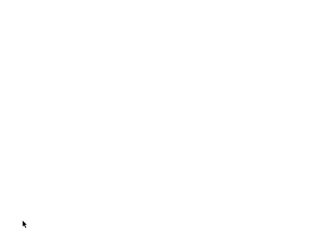

# Python Play (beta)

[](https://repl.it/@glench/Python-Play-sample-game)

## The easiest way to start coding games and graphics projects in Python

Python Play is an open-source code library for the Python programming language that makes it as easy as possible to start making games. Here's the code to make a simple game using Play:

```python
import play

cat = play.new_text('=^.^=', font_size=70)

@play.repeat_forever
async def move_cat():
    cat.x = play.random_number(-200, 200)
    cat.y = play.random_number(-200, 200)
    cat.color = play.random_color()
    
    cat.show()

    await play.timer(seconds=0.4)

    cat.hide()

    await play.timer(seconds=0.4)

@cat.when_clicked
def win_function():
    cat.show()
    cat.words = 'You won!'

play.start_program()
```

The code above makes a game where you have to click the cat to win:



**[You can try playing and changing this game on repl.it!](https://repl.it/@glench/Python-Play-sample-game)**

Python Play is an excellent choice for beginner programmers to get started with graphics programming. It was designed to have similar commands and simplicity to [MIT's Scratch](https://scratch.mit.edu) and is distinguished from such projects as Pygame, Arcade, or Pygame Zero because of its lack of boiler plate code, its easy-to-understand plain-english commands, and intuitive API. [Read more about its design at the bottom of this document](#why-use-python-play).

# How to install Python Play

Run the following command in your terminal:

    pip install replit-play

Or you can just go to [repl.it](https://repl.it/@glench/Python-Play-sample-game) and you won't have to install anything :)

# How to use Python Play

All Python Play programs start with `import play` and end with `play.start_program()`, like this:

```python
import play # this is the first line in the program


play.start_program() # this is the last line in the program
```

All other commands go between those two commands.

To try any of the following examples, go to **[repl.it and try pasting code in](https://repl.it/@glench/Replit-Play-Template)**.

## Commands

The rest of this document is divided into the following sections:

- [Basic Commands](#basic-commands) - Getting graphics, shapes, and text on the screen. Also changing the backdrop.
- [Animation and Control Commands](#animation-and-control-commands) - Animating and controlling graphics, shapes, and text.
- [Sprite Commands](#sprite-commands) - Controlling sprites.
- [Mouse Commands](#mouse-commands) - Detecting mouse actions (clicks, movement).
- [Keyboard Commands](#keyboard-commands) - Detecting keyboard actions.
- [Physics Commands](#physics-commands) - Making physics objects.
- [Other Useful Commands](#other-useful-commands) - General commands.
- [Why use Python Play?](#why-use-python-play) - How this library is different from other graphics libraries.

## Basic Commands

To get images or text on the screen, use the following commands. (Copy and paste the code below to try it out.)

#### `play.new_box()`
```python
box = play.new_box(
        color='black',
        x=0,
        y=0,
        width=100,
        height=200,
        border_color="light blue",
        border_width=10
    )
```

This will put a tall, black box in the middle of the screen.

If you want to change where the image is on the screen, try changing `x=0` (horizontal position) and `y=0` (vertical position). Just like Scratch, the middle of the screen is x=0, y=0. Increasing x moves the image right and decreasing x moves the image left. Likeswise, increasing y moves the image up and decreasing y moves the image down. You can also change the color by changing `'black'` to another color name, like `'orange'`.


#### `play.new_image()`
```python
character = play.new_image(
        image='character.png', 
        x=0, 
        y=0, 
        angle=0, 
        size=100, 
        transparency=100
    )
```

This will place an image in the middle of the screen. Make sure you have a file named `character.png` in your project files for the code above to work. You can find images online at sites like http://icons.iconarchive.com/icons/icojam/animals/64/01-bull-icon.png


#### `play.new_text()`
```python
greeting = play.new_text(
        words='hi there', 
        x=0, 
        y=0, 
        angle=0, 
        font=None, 
        font_size=50, 
        color='black', 
        transparency=100
    )
```

This will put some text on the screen.

If you want to change the font, you'll need a font file (usually named something like `Arial.ttf`) in your project files. Then you can change `font=None` to `font='Arial.ttf'`. You can find font files at sites like [DaFont](https://www.dafont.com).


#### `play.new_circle()`
```python
ball = play.new_circle(
        color='black', 
        x=0, 
        y=0, 
        radius=100, 
        border_color="light blue", 
        border_width=10, 
        transparency=100
    )
```

This will put a black circle in the middle of the screen.


#### `play.new_line()`
```python
line = play.new_line(
        color='black', 
        x=0, 
        y=0, 
        length=100, 
        angle=0, 
        thickness=1, 
        x1=None, 
        y1=None
    )
```

This will create a thin line on the screen.


#### `play.set_backdrop()`
You can change the background color with the `play.set_backdrop()` command:

```python
play.set_backdrop('light blue')
```

There are [lots of named colors to choose from](https://upload.wikimedia.org/wikipedia/commons/2/2b/SVG_Recognized_color_keyword_names.svg). Additionally, if you want to set colors by RGB (Red Green Blue) values, you can do that like this:

```python
# Sets the background to white. Each number can go from 0 to 255
play.set_backdrop( (255, 255, 255) )
```

Anywhere you can set a color in Python Play, you can do it using a named color like `'red'` or an RGB value above like `(255, 255, 255)` or even an RGBA value like `(0, 0, 0, 127)` (the fourth number is transparency from 0 to 255). You can get the current background color with `play.backdrop`.


## Animation and Control Commands

#### `@play.repeat_forever`
To make things move around, you can start by using `@play.repeat_forever`, like this:

```python
cat = play.new_text('=^.^=')

@play.repeat_forever
def do():

    cat.turn(10)  
```    

The above code will make the cat turn around forever. Sprites have other commands that you can see in the next section called Sprite Commands.

#### `@play.when_program_starts`

To make some code run just at the beginning of your project, use `@play.when_program_starts`, like this:

```python
cat = play.new_text('=^.^=')

@play.when_program_starts
def do():

    cat.turn(180)  
```

This will make the cat turn upside down instantly when the program starts.


#### `await play.timer(seconds=1)`

To run code after a waiting period, you can use the `await play.timer()` command like this:

```python
cat = play.new_text('=^.^=')

@play.when_program_starts
async def do():

    cat.turn(180)  
    await play.timer(seconds=2)
    cat.turn(180)  
```

This will make the cat turn upside down instantly when the program starts, wait 2 seconds, then turn back up again.


#### `play.repeat()` and `await play.animate()`

To smoothly animate a character a certain number of times, you can use `play.repeat()` with `await play.animate()`, like this:


```python
cat = play.new_text('=^.^=')

@play.when_program_starts
async def do():
    for count in play.repeat(180):
        cat.turn(1)
        await play.animate()
```

This code will animate the cat turning upside down smoothly when the program starts.

To break down the code:
- `for count in play.repeat(180):` runs the code 180 times.
- `cat.turn(1)` turns that cat 1 degree each time.
- `await play.animate()` makes the cat animate smoothly. Without this command, the cat would just turn upside down instantly.

Note: to use `await play.animate()` and `await play.timer()`, the word `async` must be included before `def` in your function definition.


## Sprite Commands


#### Simple commands

Sprites (images and text) have a few simple commands:

- **`sprite.move(10)`** — moves the sprite 10 pixels in the direction it's facing (starts facing right). Use negative numbers (-10) to go backward.
- **`sprite.turn(20)`** — Turns the sprite 20 degrees counter-clockwise. Use negative numbers (-20) to turn the other way.
- **`sprite.go_to(other_sprite)`** — Makes `sprite` jump to another sprite named `other_sprite`'s position on the screen. Can also be used to make the sprite follow the mouse: `sprite.go_to(play.mouse)`.
- **`sprite.go_to(x=100, y=50)`** — Makes `sprite` jump to x=100, y=50 (right and up a little).
- **`sprite.point_towards(other_sprite)`** — Turns `sprite` so it points at another sprite called `other_sprite`.
- **`sprite.point_towards(x=100, y=50)`** — Turns `sprite` so it points toward x=100, y=50 (right and up a little).
- **`sprite.hide()`** — Hides `sprite`. It can't be clicked when it's hidden.
- **`sprite.show()`** — Shows `sprite` if it's hidden.
- **`sprite.clone()`** — Makes a copy or clone of the sprite and returns it.
- **`sprite.remove()`** — Removes a sprite from the screen permanently. Calling sprite commands on a removed sprite won't do anything.
- **`sprite.start_physics()`** — Turn on physics for a sprite. See the [Physics Commands section](#physics-commands) for details.
- **`sprite.stop_physics()`** — Turn off physics for a sprite. See the [Physics Commands section](#physics-commands) for details.


#### Properties

Sprites also have properties that can be changed to change how the sprite looks. Here they are:

- **`sprite.x`** — The sprite's horizontal position on the screen. Positive numbers are right, negative numbers are left. The default is 0.
- **`sprite.y`** — The sprite's vertical position on the screen. Positive numbers are up, negative numbers are down. The default is 0.
- **`sprite.size`** — How big the sprite is. The default is 100, but it can be made bigger or smaller.
- **`sprite.angle`** — How much the sprite is turned. Positive numbers are counter-clockwise. The default is 0 degrees (pointed to the right).
- **`sprite.transparency`** — How see-through the sprite is from 0 to 100. 0 is completely see-through, 100 is not see-through at all. The default is 100.
- **`sprite.is_hidden`** — `True` if the sprite has been hidden with the `sprite.hide()` command. Otherwise `False`.
- **`sprite.is_shown`** — `True` if the sprite has not been hidden with the `sprite.hide()` command. Otherwise `False`.
- **`sprite.left`** — The x position of the left-most part of the sprite.
- **`sprite.right`** — The x position of the right-most part of the sprite.
- **`sprite.top`** — The y position of the top-most part of the sprite.
- **`sprite.bottom`** — The y position of the bottom-most part of the sprite.
- **`sprite.physics`** — Contains the physics properties of an object if physics has been turned on. The default is `None`. See the [Physics Commands section](#physics-commands) for details.


Image-sprite-only properties:

- **`sprite.image`** — The filename of the image shown. If `None` is provided initially, a blank image will show up.

Text-sprite-only properties:

- **`text.words`** — The displayed text content. The default is `'hi :)'`.
- **`text.font`** — The filename of the font e.g. 'Arial.ttf'. The default is `None`, which will use a built-in font.
- **`text.font_size`** — The text's size. The default is `50` (pt).
- **`text.color`** — The text's color. The default is black.

Box-sprite-only properties:
- **`box.color`** — The color filling the box. The default is `black`.
- **`box.width`** — The width of the box. The default is `100` pixels.
- **`box.height`** — The height of the box. The default is `200` pixels.
- **`box.border_width`** — The width of the box's border, the line around it. The default is `0`.
- **`box.border_color`** — The color of the box's border. The default is `'light blue'`.

If the box has a border, the box's total width, including the border, will be the width defined by the `width` property.

Circle-sprite-only properties:
- **`circle.color`** — The color filling the circle. The default is `black`.
- **`circle.radius`** — How big the circle is, measured from the middle to the outside. The default is `100` pixels, making a 200-pixel-wide circle.
- **`circle.border_width`** — The width of the circle's border, the line around it. The default is `0`.
- **`circle.border_color`** — The color of the circle's border. The default is `'light blue'`.

If the circle has a border, the circle's total width, including the border, will be the width defined by the `radius` property.


Line-sprite-only properties:
- **`line.color`** — The line's color. The default is `black`.
- **`line.length`** — How long the line is. Defaults to `100` (pixels).
- **`line.angle`** — The angle the line points in. Defaults to `0` (degrees).
- **`line.x1`** — The `x` coordinate of the end of the line.
- **`line.y1`** — The `y` coordinate of the end of the line.

For lines, the `x` and `y` coordinates are where the start of the line is. You can set either the `length` and `angle` or the `x1` and `y1` properties to change where the line points. If you update one, the others will be updated automatically.


These properties can changed to do the same things as the sprite commands above. For example,

```python
sprite.go_to(other_sprite)

# the line above is the same as the two lines below

sprite.x = other_sprite.x
sprite.y = other_sprite.y
```

You can change the properties to animate the sprites. The code below makes the cat turn around.

```python
cat = play.new_text('=^.^=')

@play.repeat_forever
def do():
    cat.angle += 1
    # the line above is the same as cat.turn(1)
```


#### Other info

Sprites also have some other useful info:

- **`sprite.width`** — Gets how wide the sprite is in pixels.
- **`sprite.height`** — Gets how tall the sprite is in pixels.
- **`sprite.distance_to(other_sprite)`** — Gets the distance in pixels to `other_sprite`.
- **`sprite.distance_to(x=100, y=100)`** — Gets the distance to the point x=100, y=100.
- **`sprite.is_clicked`** — `True` if the sprite has just been clicked, otherwise `False`.
- **`sprite.is_touching(other_sprite)`** — Returns True if `sprite` is touching the `other_sprite`. Otherwise `False`.
- **`sprite.is_touching(point)`** — Returns True if the sprite is touching the point (anything with an `x` and `y` coordinate). For example: `sprite.is_touching(play.mouse)`


## Mouse Commands

Working with the mouse in Python Play is easy. Here's a simple program that points a sprite at the mouse:

```python
arrow = play.new_text('-->', font_size=100)

@play.repeat_forever
def do():
    arrow.point_towards(play.mouse)
```

`play.mouse` has the following properties:

- **`play.mouse.x`** — The horizontal x position of the mouse.
- **`play.mouse.y`** — The vertical y position of the mouse.
- **`play.mouse.is_clicked`** — `True` if the mouse is clicked down, or `False` if it's not.
- **`play.mouse.is_touching(sprite)`** — Returns `True` if the mouse is touching a sprite, or `False` if it's not.


#### `@sprite.when_clicked`

Probably the easiest way to detect clicks is to use `@sprite.when_clicked`.

In the program below, when the face is clicked it changes for 1 second then turns back to normal:

```python
face = play.new_text('^.^', font_size=100)

@face.when_clicked
async def do():
    face.words = '*o*'
    await play.timer(seconds=1)
    face.words = '^.^'
```


#### `@play.when_sprite_clicked()`

If you wanted to run the same code when multiple sprites are clicked, you can use `@play.when_sprite_clicked()`:

```python
face1 = play.new_text('^.^', x=-100, font_size=100)
face2 = play.new_text('^_^', x=100, font_size=100)

@play.when_sprite_clicked(face1, face2) # takes as many sprites as you want
async def do(sprite):
    starting_words = sprite.words
    sprite.words = '*o*'
    await play.timer(seconds=1)
    sprite.words = starting_words
```

In the above program, clicking `face1` or `face2` will run the code for each sprite separately. Note that the function is defined with a parameter e.g. `def do(sprite):` instead of just `def do():`.


#### `@play.mouse.when_clicked` or `@play.when_mouse_clicked`

To run code when the mouse is clicked anywhere, use `@play.mouse.when_clicked` or `@play.when_mouse_clicked` (they do the same exact thing).

In the code below, when a click is detected, the text will move to the click location and the coordinates will be shown:

```python
text = play.new_text('0, 0')

@play.mouse.when_clicked
def do():
    text.words = f'{play.mouse.x}, {play.mouse.y}'
    text.go_to(play.mouse)
```

#### `@play.mouse.when_click_released` or `@play.when_click_released`

To run code when the mouse button is released, use `@play.mouse.when_click_released` `@play.when_click_released` (they do the same exact thing).

In the code below, the cat can be dragged around when it's clicked by the mouse:

```python
cat = play.new_text('=^.^= drag me!')
cat.is_being_dragged = False

@cat.when_clicked
def do():
    cat.is_being_dragged = True

@play.mouse.when_click_released
def do():
    cat.is_being_dragged = False

@play.repeat_forever
def do():
    if cat.is_being_dragged:
        cat.go_to(play.mouse)
```


## Keyboard Commands


#### `play.key_is_pressed()`

You can use `play.key_is_pressed()` to detect keypresses.

In the code below, pressing the `arrow` keys or `w/a/s/d` will make the cat go in the desired direction.

```python
cat = play.new_text('=^.^=')

@play.repeat_forever
def do():
    if play.key_is_pressed('up', 'w'):
        cat.y += 15
    if play.key_is_pressed('down', 's'):
        cat.y -= 15

    if play.key_is_pressed('right', 'd'):
        cat.x += 15
    if play.key_is_pressed('left', 'a'):
        cat.x -= 15
```

#### `@play.when_key_pressed()`

You can use `@play.when_key_pressed()` to run code when specific keys are pressed.

In the code below, pressing the `space` key will change the cat's face, and pressing the `enter` key will change it to a different face.

```python
cat = play.new_text('=^.^=')

@play.when_key_pressed('space', 'enter') # if either the space key or enter key are pressed...
def do(key):
    if key == 'enter':
        cat.words = '=-.-='
    if key == 'space':
        cat.words = '=*_*='
```


#### `@play.when_any_key_pressed`

If you just want to detect when any key is pressed, you can use `@play.when_any_key_pressed`.

In the code below, any key you press will be displayed on the screen:

```python
text = play.new_text('')

@play.when_any_key_pressed
def do(key):
    text.words = f'{key} pressed!'
```

#### `@play.when_key_released()`

Exactly like `@play.when_key_pressed()` but runs the code when specific keys are released.

In the code below, text will appear on screen only if the `up` arrow is pressed.

```python
text = play.new_text('')

@play.when_key_released('up')
async def do(key):
    text.words = 'up arrow released!'
    await play.timer(seconds=1)
    text.words = ''
```

#### `@play.when_any_key_released`

Exactly like `@play.when_any_key_pressed` but runs the code when any key is released.

In the code below, the name of the most recently released key will show up on screen.

```python
text = play.new_text('')

@play.when_any_key_pressed
def do(key):
    text.words = f'{key} key released!''
```


## Physics Commands

Python Play uses the [Pymunk](http://www.pymunk.org/en/master/) physics library to turn sprites into physics objects that can collide with each other, fall with gravity, and more.

### `sprite.start_physics()`

To turn a sprite into a physics object, use the `start_physics()` command:

```python
sprite.start_physics(can_move=True, stable=False, x_speed=0, y_speed=0, obeys_gravity=True, bounciness=1, mass=10, friction=0.1)
```

This will cause the sprite to start being affected by gravity, collide with other sprites that have physics, and more.


### `sprite.physics` properties

Once `sprite.start_physics()` has been called, the sprite will have a `sprite.physics` property. `sprite.physics` has the following properties:

- **`sprite.physics.can_move`** — Whether the sprite can move around the screen (`True`) or is stuck in place (`False`). Defaults to `True`.
- **`sprite.physics.stable`** — Whether the sprite is a stable object (one that can't be knocked about). A pong paddle is a stable object (`True`) but a box or ball that can be knocked around is not (`False`). Defaults to `False`.
- **`sprite.physics.x_speed`** — How fast the sprite is moving horizontally (negative numbers mean the sprite moves to the left and positive numbers mean the sprite moves to the right). Defaults to `0`.
- **`sprite.physics.y_speed`** — How fast the sprite is moving vertically (negative numbers mean the sprite moves down and positive numbers mean the sprite moves up). Defaults to `0`.
- **`sprite.physics.obeys_gravity`** — If the sprite is affected by gravity. Defaults to `True`.
- **`sprite.physics.bounciness`** — How bouncy the sprite is from 0 (doesn't bounce at all) to 1 (bounces a lot). Defaults to `1`.
- **`sprite.physics.mass`** — How heavy the sprite is. Defaults to `10`. Heavier objects will knock lighter objects around more.
- **`sprite.physics.friction`** — How much the sprite slides around on other objects. Starts at 0 (slides like on ice) to big numbers (very rough sprite that doesn't slide at all). Defaults to `0.1`.

Changing any of these properties will immediately change how the sprite acts as a physics object. Try experimenting with all these properties if you don't fully understand them.

`sprite.physics` also has two commands that could be helpful:

- **`sprite.physics.pause()`** — Temporarily stop the sprite from being a physics object. The sprite's speed and other physics properties will be saved until the `unpause()` command is used.
- **`sprite.physics.unpause()`** — Resume physics on a sprite that has been paused. It will continue with the exact speed and physics settings it had before `physics.pause()` was called.

Calling `sprite.stop_physics()` will immediately stop the sprite from moving and colliding and `sprite.physics` will be set to `None`.


### `sprite.stop_physics()`

To get a sprite to stop moving around and colliding, you can call `sprite.stop_physics`:

```python
sprite.stop_physics()
```

This will immediately stop the sprite.


### `play.set_gravity()`

To set how much gravity there is for sprites that have had `start_physics()` called on them, use the `play.set_gravity()` command:

```python
play.set_gravity(vertical=-100, horizontal=None)
```

You can access the current gravity with `play.gravity.vertical` (default is `-100`) and `play.gravity.horizontal` (default is `0`).


## Other Useful Commands


#### `play.screen`

The way to get information about the screen. `play.screen` has these properties:

- `play.screen.width` - Defaults to 800 (pixels total). Changing this will change the screen's size.
- `play.screen.height` - Defaults to 600 (pixels total). Changing this will change the screen's size.
- `play.screen.left` - The `x` coordinate for the left edge of the screen.
- `play.screen.right` - The `x` coordinate for the right edge of the screen.
- `play.screen.top` - The `y` coordinate for the top of the screen.
- `play.screen.bottom` - The `y` coordinate for the bottom of the screen.


#### `play.all_sprites`

A list of all the sprites (images, shapes, text) in the program.


#### `play.random_number()`

A function that makes random numbers.

If two whole numbers are given, `play.random_number()` will give a whole number back:

```python
play.random_number(lowest=0, highest=100)

# example return value: 42
```
(You can also do `play.random_number(0, 100)` without `lowest` and `highest`.)

If non-whole numbers are given, non-whole numbers are given back:

```python
play.random_number(0, 1.0)
# example return value: 0.84
```

`play.random_number()` is also inclusive, which means `play.random_number(0,1)` will return `0` and `1`.


#### `play.random_color()`

Returns a random RGB color, including white and black.

```python
play.random_color()
# example return value: (201, 17, 142)
```

Each value varies from 0 to 255.

#### `play.random_position()`

Returns a random position on the screen. A position object has an `x` and `y` component.

```python
text = play.text('WOO')
@play.repeat_forever
def do():
    text.go_to(play.random_position())

    # the above is equivalent to:
    position = play.random_position()
    text.x = position.x
    text.y = position.y
```

#### `play.repeat()`

`play.repeat()` is the same as Python's built-in `range` function, except it starts at 1. 'Repeat' is just a friendlier and more descriptive name than 'range'.

```python
list(play.repeat(10))
# return value: [1, 2, 3, 4, 5, 6, 7, 8, 9, 10]
```

#### `await play.animate()`

When used in a loop, this command will animate any sprite changes that happen.

```python
cat = play.new_text('=^.^=')

@play.when_program_starts
async def do():
    for count in play.repeat(360):
        cat.turn(1)
        await play.animate()
```

`await play.animate()` is the same as `await asyncio.sleep(0)` except it has a friendlier name for beginners.


## What's with all this `async`/`await` stuff? Is this Python?

Yes, this is Python! Python added `async` and `await` as special keywords in Python 3.7. It's part of the [asyncio module](https://docs.python.org/3/library/asyncio.html).

Using async functions means we can use the `await play.timer()` and `await play.animate()` functions, which makes some code a lot simpler and appear to run in-parallel, which new programmers find intuitive.

```python
import play

cat = play.new_text('=^.^=')

# this code block uses async so it can use the 'await play.timer()' function
@play.repeat_forever
async def change_bg():
    play.set_backdrop('pink')
    await play.timer(seconds=1)

    play.set_backdrop('purple')
    await play.timer(seconds=1)

    play.set_backdrop('light blue')
    await play.timer(seconds=1)

# this code block doesn't need async because it doesn't have `await play.timer()` or `await play.animate()`
@play.repeat_forever
def do():
    cat.turn(1)

play.start_program()
```

In the above program, the backdrop will change and the cat will appear to turn at the same time even though the code is running single-threaded.

The `async` keyword isn't necessary to write unless you want to use `await` functions. If you try to use an `await` command inside a non-async function, Python will show you an error like this:

```  
  File "example.py", line 31
    await play.timer(seconds=1)
    ^
SyntaxError: 'await' outside async function
```
To fix that error, just put `async` before `def`.

If you don't understand any of this, it's generally safe to just include `async` before `def`.

## Why use Python Play?

Python Play was designed to be an excellent starting point for brand new programmers. The goal of the project is to give someone that has never programmed before a compelling and successful experience in their first few minutes of programming. We aimed to make graphics programming as accessible as possible to as young an audience as possible.

We found that many existing programming languages and graphics libraries presented unnecessary difficulties for new programmers — difficulties making simple things happen, confusing language, confusing program flow, unexplained concepts, etc. We know that even one initial disagreeable experience can turn people away from programming forever, and we wanted to prevent that outcome as much as possible.

Python Play was inspired by [MIT's Scratch](https://scratch.mit.edu), which has introduced millions of children and adults to programming and helped them to create and share personally meaningful computational projects. In fact, Python Play's main designer worked on Scratch professionally for a brief period. But we found that for some learners, Scratch — with its graphical blocks and colorful interface — didn't feel like "real programming". For those learners wishing to use a mainstream textual programming language while removing the difficulties of graphics programming in these languages, we made Python Play.


Python Play was designed with the following principles in mind:

- No boilerplate - every line of code should do something meaningful and understandable. We want to limit the number of times a learner needs to ask "why do we have to include this line of code?"

- As much as possible, commands should have immediate visual effects. For example, if a programmer types a `new_image` command the sprite should show up immediately on the screen. They shouldn't need to understand the invisible distinction between initializing a sprite and drawing the sprite.

- Lines of code should be easily copy and pasted.

- Command values should have descriptive labels that make it as clear as possible what the value means. Instead of `play.new_image('character.png', 50, 100)`, `play.new_image(image='character.png', x=50, y=100)`.

- Use plain English as much as possible. For mathematical concepts, try to use language programmers might see in math classes. Try to use short names that are easier for younger people to type and spell. Make errors as clear and constructive as possible. Many of the commands and names were borrowed from Scratch, whose designers have spent decades working with children and observing what language makes sense to them.


Python Play was also designed with a custom Repl.it IDE in mind (coming soon), one that significantly lowers the usability problems of programming (installing the language, using a text editor, using the terminal, running programs, showing which commands are available, etc).

While the learning curve for Python and Python Play are still far from ideal for new programmers, we still think Python Play provides a great way for new programmers to start programming with graphics.

<3
